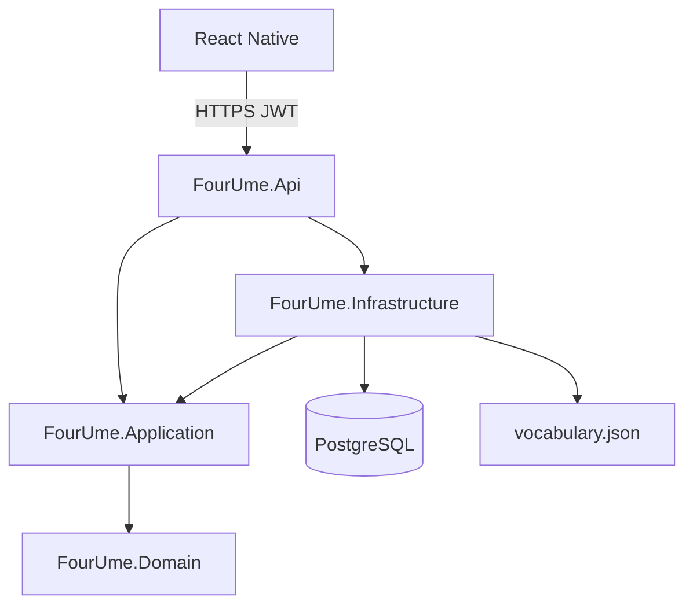

# 4UME — Architecture

App học tiếng Anh cho người Việt: từ vựng (flashcard), ngữ pháp căn bản, bài tập; nhiều người dùng, lưu tiến trình trên server.

## Local path

Trên máy cá nhân, clone/mở project tại:

```text
/Users/lamvhx/Projects/4UME
```

Trên Cloud Agent, working tree là root repo (`/workspace` tương đương nội dung repo).

## Tech stack (đã chốt)

| Lớp | Công nghệ | Vai trò |
|---|---|---|
| API | .NET 9, Clean Architecture | Auth JWT, từ vựng, ngữ pháp, tiến trình |
| Mobile | React Native (Expo, TypeScript) | App chính trên iOS/Android |
| DB | PostgreSQL 16 | User, tiến trình từ, điểm bài tập |
| Container | Docker + Docker Compose | Chạy API + Postgres trên Linux |
| OS server | Linux | Host production / VPS |
| Web admin | React + Vite + Mantine | Quản lý nội dung, người dùng, cài đặt |
| Nội dung từ | `backend/data/vocabulary.json` → database | 7.544 từ A1–B2, 27 bộ; 46 bài ngữ pháp |
| Email | Resend (HTTP API) | Mã xác nhận đăng ký / quên mật khẩu |

Không dùng danh sách Oxford 3000 chính thức trong app (cần giấy phép OUP).

## Repository layout

```text
/Users/lamvhx/Projects/4UME
├── architecture.md              # file này
├── backend/
│   ├── FourUme.sln
│   ├── FourUme.Domain/          # Entities, enums
│   ├── FourUme.Application/     # Use cases, DTOs, interfaces
│   ├── FourUme.Infrastructure/  # EF Core, JWT, seed vocabulary
│   ├── FourUme.Api/             # HTTP endpoints
│   ├── data/
│   │   ├── vocabulary.json      # nguồn từ vựng
│   │   └── raw/                 # TSV nguồn để rebuild JSON
│   └── scripts/
│       └── build_vocabulary.py
├── deploy/
│   └── Dockerfile               # API image
├── docker-compose.yml
├── docs/
│   └── ui/                      # mock UI + DESIGN.md
├── mobile/                      # Expo React Native app
└── README.md
```

## Clean Architecture (.NET 9)



- **Domain**: `User`, `WordProgress`, `GrammarLesson`, `GrammarAttempt`, enums trạng thái từ.
- **Application**: đăng ký/đăng nhập, lấy bộ từ, cập nhật tiến trình flashcard, lấy bài ngữ pháp, nộp bài tập.
- **Infrastructure**: EF Core + Npgsql, password hash, JWT, đọc/seed `vocabulary.json`.
- **Api**: Minimal APIs hoặc controllers mỏng; không chứa business logic.

v1 không thêm MediatR/CQRS/event bus trừ khi sau này cần.

## PostgreSQL — bảng chính (cập nhật 10/10/2026)

| Bảng | Nội dung |
|---|---|
| `Users` | email, mật khẩu băm, tên hiển thị, `Role` (user / admin), `LockedAt`, cài đặt học + nhắc, chuỗi ngày (đóng băng, dài nhất) |
| `Decks`, `Words` | Bộ từ và từ (nghĩa, phiên âm, ví dụ, ảnh, `ImagePending`, `Published`, `EditedAt`) |
| `WordProgresses` | Tiến độ từng từ của người học (`new` / `hard` / `known`, cấp ôn tập, lần ôn tới) |
| `GrammarLessons`, `GrammarProgresses`, `GrammarAttempts` | Bài ngữ pháp (lý thuyết + bài tập dạng JSON), tiến độ và lượt làm |
| `StudyDays` | Ngày có học (tính chuỗi, biểu đồ) |
| `MediaFiles` | Ảnh trong thư viện (kể cả nguồn Pexels / Pixabay) |
| `DeviceTokens`, `NotificationLogs` | Thiết bị nhận thông báo, thông báo đã gửi |
| `AppSettings` | Thông số hệ thống chỉnh trong admin (JSON) |
| `AuditLogs` | Lịch sử thay đổi nội dung / quyền (trước / sau) |
| `EmailCodes` | Mã xác nhận qua email (chỉ lưu bản băm) — [docs/email.md](docs/email.md) |

Từ vựng / ngữ pháp nạp lần đầu từ `backend/data/` rồi database là nguồn chính (sửa qua web admin). Tiến trình luôn gắn người dùng trên DB — không dùng `localStorage` làm nguồn chính.

## API bề mặt cho app

| Method | Path | Mô tả |
|---|---|---|
| POST | `/api/auth/register/code` | Gửi mã xác nhận tới email đăng ký |
| POST | `/api/auth/register` | Tạo tài khoản (cần mã), trả JWT |
| POST | `/api/auth/login` | Đăng nhập, trả JWT |
| POST | `/api/auth/password/code` | Gửi mã đặt lại mật khẩu |
| POST | `/api/auth/password/reset` | Đặt mật khẩu mới bằng mã, trả JWT |
| GET | `/api/me`, `/api/me/stats` | Hồ sơ, chuỗi ngày, thống kê |
| PUT | `/api/me/settings` | Cài đặt học / nhắc / múi giờ |
| POST | `/api/me/password`, `/api/me/delete` | Đổi mật khẩu, xoá tài khoản |
| POST / DELETE | `/api/me/devices`, `/api/me/devices/{token}` | Đăng ký / gỡ thiết bị nhận thông báo |
| GET | `/api/config` | Thông số hệ thống cho app |
| GET | `/api/vocabulary/decks`, `/decks/{id}`, `/search` | Bộ từ + tiến độ, từ trong bộ, tìm từ |
| POST | `/api/vocabulary/progress` | Cập nhật trạng thái từ (flashcard) |
| GET / POST | `/api/review/summary`, `/forecast`, `/due`, `/answer`, `/practice`, `/practice/answer` | Ôn tập từ vựng |
| GET / POST | `/api/grammar/lessons`, `/lessons/{slug}`, `/lessons/{slug}/complete` | Bài ngữ pháp |
| GET / POST | `/api/grammar/review/summary`, `/due`, `/practice`, `/answer`, `/practice/answer` | Ôn tập ngữ pháp |

API cho web admin (`/api/admin/*`): [docs/admin-web.md](docs/admin-web.md#api-dự-kiến).

## Mobile (React Native / Expo)

Màn hình theo mock `docs/ui/` (tên brand **4UME**):

1. Chào / Đăng nhập / Đăng ký  
2. Trang chủ — Từ vựng | Ngữ pháp  
3. Danh sách bộ từ (+ lọc level)  
4. Flashcard — mặt trước EN+IPA; chạm → nghĩa VI + ví dụ; Chưa nhớ / Khó / Đã nhớ  
5. Danh sách ngữ pháp → bài giảng + bài tập  
6. Hồ sơ — tiến trình trên server  

Design tokens: xem [`docs/ui/DESIGN.md`](docs/ui/DESIGN.md). Accent teal `#0F6B5C`, nền mint–sage.

## Docker (Linux)

`docker compose up` khởi động:

- `postgres` — volume persistent, port nội bộ  
- `api` — .NET 9, migrate + seed khi start, expose port API (vd. `5088`)

Production: cùng Compose hoặc reverse proxy (Caddy/Nginx) trên VPS Linux.

## Bảo mật v1

- Mật khẩu: ASP.NET Identity password hasher
- JWT Bearer (7 ngày), secret qua biến môi trường; tài khoản bị khoá / xoá thì token cũ bị từ chối ngay
- Đăng ký và đặt lại mật khẩu phải có mã 6 số gửi qua email (10 phút, tối đa 5 lần sai, giới hạn gửi theo email và IP)
- Không commit connection string / JWT secret / API key thật (để trong `.env`, git bỏ qua)

## Thứ tự triển khai

1. Architecture + UI mock (xong)  
2. Scaffold API + Postgres + Docker  
3. Scaffold mobile gắn API  
4. Ngữ pháp + bài tập  
5. Verify end-to-end trên Docker  
