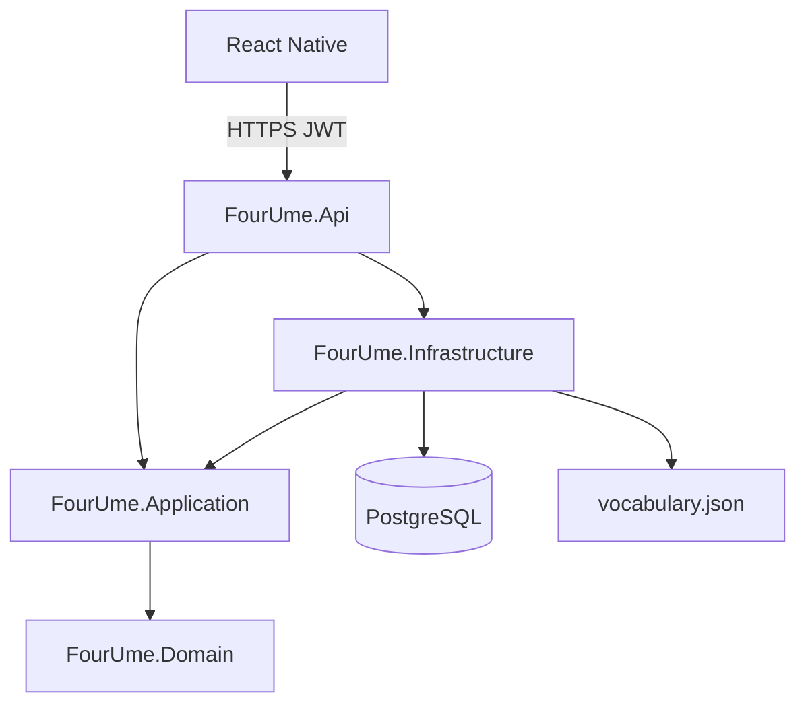

# 4UME — Architecture

App học tiếng Anh cho người Việt: từ vựng (flashcard), ngữ pháp căn bản, bài tập; nhiều người dùng, lưu tiến trình trên server.

## Local path

Trên máy cá nhân, clone/mở project tại:

```text
/Users/lamvhx/Projects/4UME
```

Trên Cloud Agent, working tree là root repo (`/workspace` tương đương nội dung repo).

## Tech stack (đã chốt)

| Lớp | Công nghệ | Vai trò |
|---|---|---|
| API | .NET 9, Clean Architecture | Auth JWT, từ vựng, ngữ pháp, tiến trình |
| Mobile | React Native (Expo, TypeScript) | App chính trên iOS/Android |
| DB | PostgreSQL 16 | User, tiến trình từ, điểm bài tập |
| Container | Docker + Docker Compose | Chạy API + Postgres trên Linux |
| OS server | Linux | Host production / VPS |
| Nội dung từ | `backend/data/vocabulary.json` | ~3.308 mục A1–B2 (tự biên) |

Không dùng danh sách Oxford 3000 chính thức trong app (cần giấy phép OUP).

## Repository layout

```text
/Users/lamvhx/Projects/4UME
├── architecture.md              # file này
├── backend/
│   ├── FourUme.sln
│   ├── FourUme.Domain/          # Entities, enums
│   ├── FourUme.Application/     # Use cases, DTOs, interfaces
│   ├── FourUme.Infrastructure/  # EF Core, JWT, seed vocabulary
│   ├── FourUme.Api/             # HTTP endpoints
│   ├── data/
│   │   ├── vocabulary.json      # nguồn từ vựng
│   │   └── raw/                 # TSV nguồn để rebuild JSON
│   └── scripts/
│       └── build_vocabulary.py
├── deploy/
│   └── Dockerfile               # API image
├── docker-compose.yml
├── docs/
│   └── ui/                      # mock UI + DESIGN.md
├── mobile/                      # Expo React Native app
└── README.md
```

## Clean Architecture (.NET 9)



- **Domain**: `User`, `WordProgress`, `GrammarLesson`, `GrammarAttempt`, enums trạng thái từ.
- **Application**: đăng ký/đăng nhập, lấy bộ từ, cập nhật tiến trình flashcard, lấy bài ngữ pháp, nộp bài tập.
- **Infrastructure**: EF Core + Npgsql, password hash, JWT, đọc/seed `vocabulary.json`.
- **Api**: Minimal APIs hoặc controllers mỏng; không chứa business logic.

v1 không thêm MediatR/CQRS/event bus trừ khi sau này cần.

## PostgreSQL — bảng chính

| Bảng | Nội dung |
|---|---|
| `users` | id, email, password_hash, display_name, created_at |
| `word_progress` | user_id, word_id, status (`new`/`hard`/`known`), next_review_at, updated_at |
| `grammar_attempts` | user_id, lesson_slug, score, total, created_at |

Từ vựng: seed từ JSON vào bảng `words` (hoặc serve từ file ở bản đầu). Tiến trình luôn gắn `user_id` trên DB — không dùng `localStorage` làm nguồn chính.

## API bề mặt (v1)

| Method | Path | Mô tả |
|---|---|---|
| POST | `/api/auth/register` | Tạo tài khoản |
| POST | `/api/auth/login` | Đăng nhập, trả JWT |
| GET | `/api/me` | Hồ sơ + thống kê nhanh |
| GET | `/api/vocabulary/decks` | Danh sách bộ từ + tiến độ user |
| GET | `/api/vocabulary/decks/{id}` | Từ trong bộ |
| POST | `/api/vocabulary/progress` | Cập nhật trạng thái từ (flashcard) |
| GET | `/api/grammar/lessons` | 10 bài ngữ pháp |
| GET | `/api/grammar/lessons/{slug}` | Nội dung + câu hỏi |
| POST | `/api/grammar/lessons/{slug}/submit` | Nộp bài, lưu điểm |

## Mobile (React Native / Expo)

Màn hình theo mock `docs/ui/` (tên brand **4UME**):

1. Chào / Đăng nhập / Đăng ký  
2. Trang chủ — Từ vựng | Ngữ pháp  
3. Danh sách bộ từ (+ lọc level)  
4. Flashcard — mặt trước EN+IPA; chạm → nghĩa VI + ví dụ; Chưa nhớ / Khó / Đã nhớ  
5. Danh sách ngữ pháp → bài giảng + bài tập  
6. Hồ sơ — tiến trình trên server  

Design tokens: xem [`docs/ui/DESIGN.md`](docs/ui/DESIGN.md). Accent teal `#0F6B5C`, nền mint–sage.

## Docker (Linux)

`docker compose up` khởi động:

- `postgres` — volume persistent, port nội bộ  
- `api` — .NET 9, migrate + seed khi start, expose port API (vd. `5088`)

Production: cùng Compose hoặc reverse proxy (Caddy/Nginx) trên VPS Linux.

## Bảo mật v1

- Mật khẩu: ASP.NET Identity password hasher (hoặc BCrypt)  
- JWT Bearer, secret qua biến môi trường  
- CORS chỉ origin mobile/dev  
- Không commit connection string / JWT secret thật  

## Thứ tự triển khai

1. Architecture + UI mock (xong)  
2. Scaffold API + Postgres + Docker  
3. Scaffold mobile gắn API  
4. Ngữ pháp + bài tập  
5. Verify end-to-end trên Docker  
